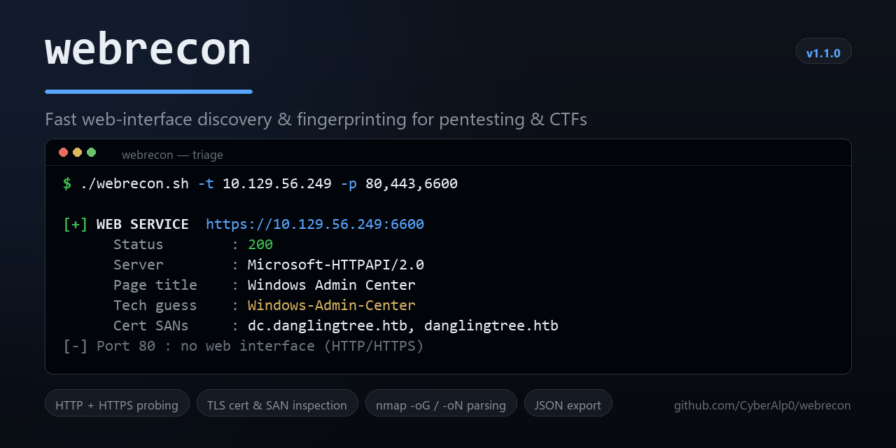

# WebRecon

**Fast web-interface discovery & fingerprinting for penetration testing and CTFs.**

`WebRecon` takes a target and a list of ports, then tells you — quickly and
readably — which ports are actually serving **web interfaces** (HTTP/HTTPS) and
what technology sits behind each one. It's the fast triage step between a port
scan and deep web enumeration.

```
nmap  ──►  WebRecon  ──►  whatweb / browser / gobuster
(what's    (which ports    (deep-dive the
 open?)     are web?)       web apps that matter)
```

---

## Why it exists

After an `nmap` scan you're often staring at a list of open ports — `80`, `443`,
`6600`, `8080`, `593` — and the first question is *"which of these can I hit in a
browser, and what are they running?"* Doing that by hand with `curl` for every
port, over both HTTP and HTTPS, gets tedious fast.

`WebRecon` automates exactly that check and prints a clean, per-port report:
status code, server software, page title, redirects, required auth, and a
best-effort technology guess.

> **Scope:** `WebRecon` is a *web-triage* tool, not a replacement for `nmap`.
> `nmap` is authoritative for identifying *any* service; `WebRecon` is sharper and
> more readable once you specifically care about the web ones. Use them together.

---

## Features

- Probes **both HTTP and HTTPS** on every port (self-signed certs are ignored).
- Reports **status code, `Server`, `X-Powered-By`, `Content-Type`, page `<title>`,
  redirect target, and `WWW-Authenticate`** (auth type) per service.
- **Technology fingerprinting** for common stacks (IIS, Apache, nginx, Flask,
  Tomcat, WordPress, Jenkins, Grafana, GitLab, Windows Admin Center, ASP.NET, …).
- **TLS certificate inspection** on every HTTPS service — subject, issuer,
  Subject Alternative Names (SANs), expiry date, and an **EXPIRED** flag.
  SANs frequently leak internal hostnames worth adding to your `/etc/hosts`.
- **Parses `nmap` output** (`-oG`/`-oN`) so you can pipe straight from a scan.
- **JSON export** (`-o report.json`) for use in larger workflows.
- Colored, human-readable output that **auto-disables when piped**.
- **Zero heavy dependencies** — just `curl` and standard GNU tools.

---

## Installation

```bash
git clone https://github.com/CyberAlp0/WebRecon.git
cd WebRecon
chmod +x webrecon.sh
```

Optionally put it on your `PATH`:

```bash
sudo ln -s "$(pwd)/webrecon.sh" /usr/local/bin/webrecon
```

### Requirements

- `bash` 4+
- `curl`
- `openssl` *(optional — enables TLS certificate inspection; the script runs
  without it and simply skips the cert block)*
- Standard GNU `grep`, `sed`, `coreutils` (present on Kali, Parrot, most Linux)

---

## Usage

```text
webrecon.sh -t <target> -p <ports>            [options]
webrecon.sh -t <target> -n <nmap_output_file> [options]
```

| Flag | Long form | Description |
|------|-----------|-------------|
| `-t` | `--target`  | Target IP or hostname (required) |
| `-p` | `--ports`   | Comma-separated ports, e.g. `80,443,6600` |
| `-n` | `--nmap`    | Parse open ports from an nmap `-oG`/`-oN` file |
| `-o` | `--output`  | Write a JSON report to a file |
| `-T` | `--timeout` | Per-request timeout in seconds (default `6`) |
| `-q` | `--quiet`   | Print only confirmed web services |
|      | `--no-color`| Disable colored output |
| `-h` | `--help`    | Show help |
| `-V` | `--version` | Show version |

---

## Examples

**Basic — check a handful of ports:**

```bash
./webrecon.sh -t 10.129.56.249 -p 80,443,6600,8080
```

**Pipe straight from an nmap scan:**

```bash
nmap -Pn -p- --min-rate 3000 -oG scan.gnmap 10.129.56.249
./webrecon.sh -t 10.129.56.249 -n scan.gnmap
```

**Quiet mode + JSON export (good for scripting):**

```bash
./webrecon.sh -t target.htb -p 80,443,8080 --quiet -o web.json
```

### Sample output

```text
=========================================================
 WebRecon v1.1.0 — 10.129.56.249
 Ports: 80,443,6600
=========================================================

[+] WEB SERVICE  https://10.129.56.249:6600
      Status        : 200
      Server        : Microsoft-HTTPAPI/2.0
      Content-Type  : text/html
      Page title    : Windows Admin Center
      Auth required : Negotiate
      Tech guess    : Windows-Admin-Center
      --- TLS certificate ---
      Cert subject  : CN=dc.danglingtree.htb
      Cert issuer   : CN=danglingtree-DC-CA
      Cert SANs     : dc.danglingtree.htb, danglingtree.htb
      Cert expires  : Aug  3 16:42:49 2126 GMT
      Cert status   : valid

[-] Port 80 : no web interface (HTTP/HTTPS)

[*] Scan complete. Deep-fingerprint any hit with: whatweb -a3 <url>
```

---

## Where it fits in a real workflow

1. **Discover open ports** with `nmap` (use `-Pn` on hosts that block ping):
   ```bash
   nmap -Pn -p- --min-rate 3000 -oG scan.gnmap <target>
   ```
2. **Triage the web surface** with `WebRecon` — fast yes/no + summary per port.
3. **Deep-fingerprint** the interesting hits with a specialist tool:
   ```bash
   whatweb -a3 https://<target>:<port>
   ```
4. **Enumerate** the app (directories, vhosts, params) with `ffuf`/`gobuster`,
   or open it in a browser through Burp.

`WebRecon` deliberately owns step 2 only, and does it well.

---

## Roadmap

- [x] TLS certificate details (issuer, SAN, expiry) — *added in v1.1.0*
- [ ] Parallel probing for large port lists
- [ ] Favicon-hash fingerprinting (Shodan-style)
- [ ] Optional integration hand-off to `whatweb`/`httpx`
- [ ] Markdown & HTML report output

Contributions welcome — see below.

---

## Contributing

1. Fork the repo and create a feature branch.
2. Keep it dependency-light (POSIX-ish `bash` + `curl` where possible).
3. Test against a few real services and add a note in the PR.
4. Open a pull request describing the change.

The technology-fingerprint map in `probe_url()` is intentionally easy to extend —
adding a new stack is usually a one-line `grep`.

---

## Legal & ethical use

`WebRecon` is provided for **authorized security testing and education only**
(your own systems, deliberately vulnerable labs, or targets you have **explicit
written permission** to test — e.g. Hack The Box, TryHackMe, a signed engagement).

Scanning systems you do not own or have permission to test may be illegal in your
jurisdiction. **You are solely responsible for how you use this tool.** The author
accepts no liability for misuse.

---

## License

Released under the [MIT License](LICENSE).

---

## Author

Built by **CyberAlp0** — [CyberSkii](https://cyberskii.com) ·
bilingual (EN/AR) cybersecurity awareness & training.
